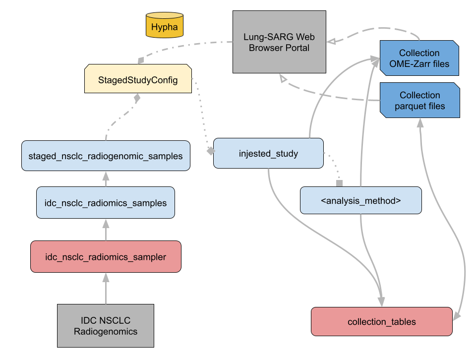
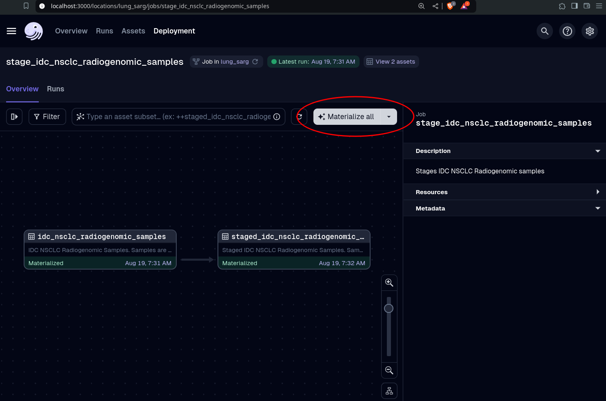

<!-- markdownlint-disable MD033 MD041-->

<p align="center">
  <h1 style="font-size:80px; font-weight: 800;" align="center">L U N G - S A R G</h1>
  <p align="center">The Open Data Platform for Sustainable, Accessible Lung Radiogenomics</a> </p>
</p>

<div align="center">
  
  
  
</div>

<br>

Lung-SARG is a fully open-source and local-first platform that improves how communities collaborate on open data to diagnose lung cancer and perform epidemiology on local populations in low and middle income countries.

> [!TIP]
> Datasets generated by this project are ready to explore and consume at HuggingFace.
>
> [Check them out](https://huggingface.co/radiogenomics)!

### 💡 Principles

- **Open**: Code, standards, infrastructure, and data, are public and open source.
- **Modular and Interoperable**: Each component can be replaced, extended, or removed. Works well in many environments (your laptop, in a cluster, or from the browser), can be deployed to many places (S3 + GH Pages, IPFS, ...) and integrates with multiple tools (thanks to the Arrow and Zarr ecosystems). Use open tools, standards, infrastructure, and share data in accessible formats.
- **Data as Code**: Declarative stateless transformations tracked in `git`. Improves data access and empowers data scientists to conduct research and helps to guide community-driven analysis and decisions. Version your data as code! Publish and share your reusable models for others to build on top. Datasets should be both reproducible and accessible!
- **Glue**: Be a bridge between tools and approaches. E.g: Use software engineering good practices like types, tests, materialized views, and more.
- [**FAIR**](https://www.go-fair.org/fair-principles/).
- **KISS**: Minimal and flexible. Rely on tools that do one thing and do it well.
- **No vendor lock-in**
  - Rely on Open code, standards, and infrastructure.
  - Use the tool you want to create, explore, and consume the datasets. Agnostic of any tooling or infrastructure provider.
  - Standard format for data and APIs! [Keep your data as future-friendly and future-proof as possible](https://indieweb.org/longevity)!
- **Distributed**: Permissionless ecosystem and collaboration. Open source code and make it ready to be improved.
- **Community**: that incentives contributors.
- **Immutability**: Embrace idempotency. Rely on content-addressable storage and append-only logs.
- **Stateless and serverless**: as much as possible. E.g. use GitHub Pages, host datasets on S3, interface with HTML, JavaScript, and WASM. No servers to maintain, no databases to manage, no infrastructure to worry about. Keep infrastructure management lean.
- **Offline-first**: Rely on static files and offline-first tools.
- **Above all, have fun and enjoy the process** 🎉

## Overview



*Lung SARG dataflow.*

## ⚙️ Setup and execution

### 🐍 Pixi

You can install all the dependencies inside a reproducible software environment via pixi. To do that, [install pixi](https://pixi.sh), clone the repository, and run the following command from the root folder.

```bash
pixi install -a
```

To see all tasks available:

```bash
pixi task list
```

Start and access the [Dagster UI](http://127.0.0.1:3000) locally.

```bash
pixi run dev
```

### 🧬 Run on sample data

In the Dagster UI, click

 > *Overview* -> *Jobs* -> *stage_idc_nsclc_radiogenomic_samples* -> *Materialize all*



Observe what happens in the *Overview*, *Runs*, and *Assets* pages of the Dagster UI, and the content in the *lung-sarg/data* directory.


## 🎯 Motivation

This project started after [thinking about what an Open Data Protocol could look like](https://publish.obsidian.md/davidgasquez/Open+Data)!

## 👏 Acknowledgements

- This project was built on the principles espoused by David Gasquez at [Datonic](https://datonic.io). It is built on the approach in the [Datadex](https://datadex.datonic.io/) Open Data Platform and extended for scientific imaging data with [OME-Zarr](https://ngff.openmicroscopy.org/) and the DICOM-based image data model in the [NIH Imaging Data Commons](https://portal.imaging.datacommons.cancer.gov/).
- Lung-SARG is possible thanks to amazing open source projects like [DuckDB](https://www.duckdb.org/), [dbt](https://getdbt.com), [Dagster](https://dagster.io/), [ITK](https://docs.itk.org) and many others...
- This project was built with support from Dr. James Gee in collaboration with the [UPenn PICSL Lab](https://picsl.upenn.edu/).
